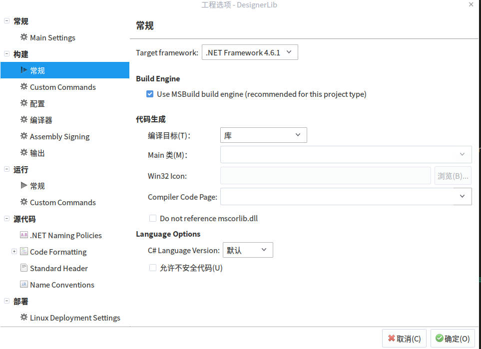
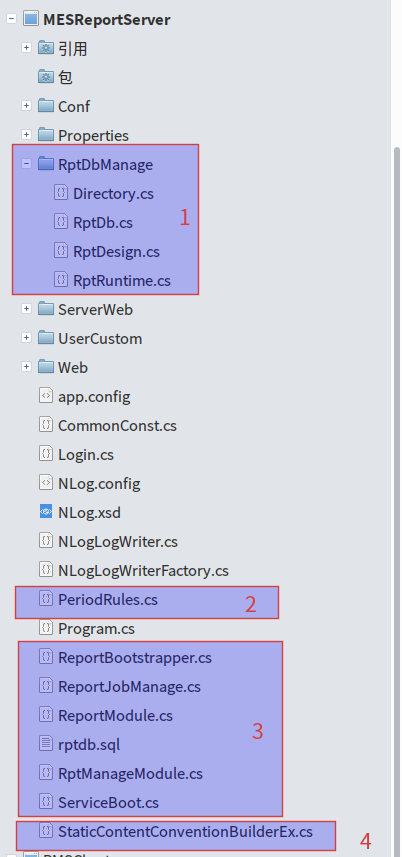
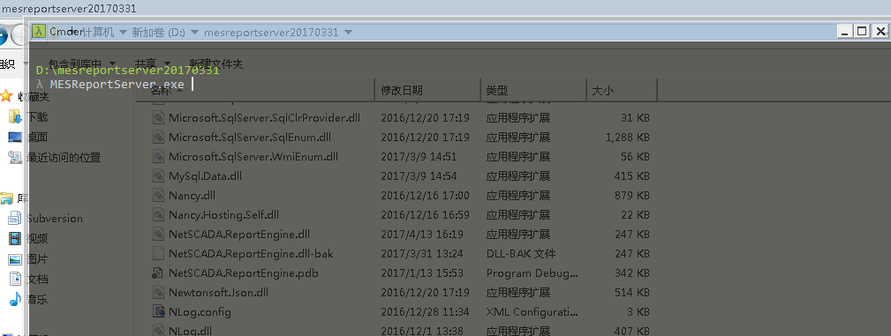
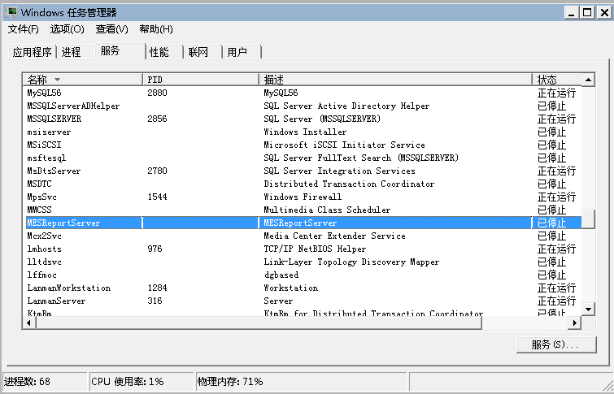
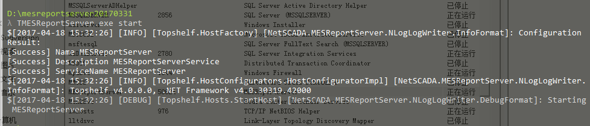

# 模块说明

1. DesignerLib
2. ECharts 说明：echart C# sdk [github地址](https://github.com/ecomfe/echarts)
https://github.com/ecomfe/echarts
3. Host
4. HtmlTags 说明：html标签封装类
5. Loader
6. MESPublicInterface
7. MESReportRun
8. MESReportServer 说明：服务入口
9. PMSChart
10. PmsPublicData
11. PMSPublicInfo
12. PmsReportControls
13. ReportEngine

     + 所有有关html/echart转换代码，当时为了将改动范围限制在最小范围内，所以都将代码放在了Extension.cs 类中。
     + ReportDrawing.cs 中将导出代码统一在了 ExportReportThreadForUbun () 方法中，
     期初只为了考虑在ubuntu下运行，后来由于独立成服务端，尽量做到与界面无关，所以当前系统只要是以服务运行，则都执行ExportReportThreadForUbun()该方法。代码如下 
     
     ```csharp
        		
        public void ExportReportThread ()
		{
			if (CurrentPrjInfo.CurrentEnvironment == MESEnvironment.MESReportServer) {//(System.Environment.OSVersion.Platform == PlatformID.Unix) {
				this.ExportReportThreadForUbun ();
			} else {
				this.ExportReportThreadForWin ();
			}
		}
     ```

      + ReportPageDrawing.cs 文件中 ExportPage()，DrawPage()函数在原来基础上改动比较大，去掉了有关gdi绘图的代码，因为此部分代码已经不需要了，但是原来DrawPage()还保留，只是重载了该方法。

      + 另外原来有关invoke 调用windowsApi的代码没有去掉，编译不受影响，所以就没有动。


**其他未说明的，都是原有类库，并且改动不大，所有改动的地方都标记了//TODO: qiuleilei 的字样，以便在开发环境中的todolist中查找到。**

# 使用monodevelop开发说明
+ mono 版本：目前使用的是 mono .Net Framework4.6.1 如图


+ 有时候全部编译的时候会报奇怪的错误，比如 ：错误提示 Unknow 或者 common.target 等问题，不用管，关掉 重新在打开，重新编译就可以了。

+ 调试的时候，由于启动的时候是在MESReportServer/bin/Debug路径下，但是调试文件有时候可能不是你最新编译的调试文件，所以需要将最新调试文件放到该目录下边，linux下的调试文件是后缀是.mdb

+ 安装mono 命令  sudo apt-get install mono-complete 

+ 安装monodevelop 命令 sudo apt-get install monodevelop

+ 文件目录说明 服务启动目录 MESReportServer/bin/debug
    
    * Conf 目前放置的配置文件有
        - job.conf -- 计划任务配置文件，后续最好还是放在数据库中
        - usr.conf -- 用户登陆配置文件，后续应该放到数据库中
        - RefDBSources.dbs
    * ServerWeb 导出的报表及查询过的报表结果文件都在这里
        - Export 放置导出的报表
        - Query 查询过的报表
    * UserCustom 放置rpt文件的文件夹，所有rpt文件都会放在此处
    * Web 如果前端展示界面不是在mes系统里，可以直接放置在这里。作为页面托管
+ 第三方库
    * ManagedThreadPool 文件路径 .. ReportEngine/PMSPublicInfo/ManagedThreadPool.cs，
    自定义线程池管理类。**其中 _maxWorkerThreads=100 默认100，后续最好放到配置文件里。**
     * Dapper& Dapper.Contrib 数据库orm,[github地址](https://github.com/StackExchange/Dapper) https://github.com/StackExchange/Dapper
     * FluentScheduler 周期性计划任务，[github地址](https://github.com/fluentscheduler/FluentScheduler)
     https://github.com/fluentscheduler/FluentScheduler
     * MySql.Data mysql数据库驱动 
     * Nancy&Nancy.Hosting.Self 跨平台轻量级mvc框架，此处用作对外提供webapi
     [github地址](https://github.com/NancyFx/Nancy)
     https://github.com/NancyFx/Nancy
     * topshelf&topshelf.linux&topshelf.nancy 简化windows服务开发组件
      [github地址](https://github.com/Topshelf/Topshelf) 
      https://github.com/Topshelf/Topshelf
      [使用手册地址](https://topshelf.readthedocs.io/en/latest/) 
      https://topshelf.readthedocs.io/en/latest/
    * EcmaScript.Net 支持c# js解析
    * Microsoft.Extensions.ObjectPool 微软对象池
    * Yahoo.Yui.Compressor js压缩
+ 部分代码说明



  * 1 rpt文件及相关目录管理类
  * 2 周期性计划任务相关实体类
  * 3 提供对外接口的相关类
    
    - ReportBootstrapper.cs Nancy启动初始化类

```csharp
// 此段代码是初始化nancy静态文件的地方
protected override void ConfigureConventions (NancyConventions nancyConventions)
		{
			base.ConfigureConventions (nancyConventions);
			//nancyConventions.StaticContentsConventions.Add (StaticContentConventionBuilder.AddDirectory ("ServerWeb"));
			nancyConventions.StaticContentsConventions.Add (StaticContentConventionBuilderEx.AddDirectory ("ServerWeb/Query"));
			nancyConventions.StaticContentsConventions.Add (StaticContentConventionBuilderEx.AddDirectory ("ServerWeb/Export"));
			nancyConventions.StaticContentsConventions.Add (StaticContentConventionBuilderEx.AddDirectory ("Web"));
//			nancyConventions.StaticContentsConventions.Add (StaticContentConventionBuilder.AddDirectory ("content"));
//			nancyConventions.StaticContentsConventions.Add (StaticContentConventionBuilder.AddDirectory ("css"));
//			nancyConventions.StaticContentsConventions.Add (StaticContentConventionBuilder.AddDirectory ("fonts"));

		}

//支持跨域 
        static void AllowAccessToConsumingSite (IPipelines pipelines)
		{
			pipelines.AfterRequest.AddItemToEndOfPipeline (x => {
				x.Response.Headers.Add ("Access-Control-Allow-Origin", "*");
				x.Response.Headers.Add ("Access-Control-Allow-Methods", "POST,GET,DELETE,PUT,OPTIONS");
			});
		}

        protected override void ApplicationStartup (TinyIoCContainer container, IPipelines pipelines)
		{
			base.ApplicationStartup (container, pipelines);
			AllowAccessToConsumingSite (pipelines);
		}
```
  - StaticContentConventionBuilderEx.cs 支持跨域类
  - RptManageModule.cs & ReportModule.cs 提供对外restful api接口
  - ReportJobManage.cs 实现功能如下：
    
    + 计划任务解析，初始化
    + rpt文件目录及报表导出目录与数据库同步

+ 配置文件app.config说明
    ```xml
    <configuration>
	<appSettings>
		<add key="port" value="8192" /> <!--端口-->
		<add key="domain" value="http://192.167.8.51" /> <!--访问地址-->
		<add key="isUsedLogin" value="0" /><!--是否启用登陆 0-否，1-是-->
		<add key="threadCount" value="100" /> <!--线程池最大数量,暂时还没实现-->
		<add key="isSyncWhenStart" value="1" /><!--启动时是否进行数据库与rpt目录同步-->
		<add key="clearQueryFilesInterval" value="1" /> <!--周期性清Query下的文件，默认1天清理一次-->
		<add key="clearQueryFilesIntervalTime" value="00:00" /><!--周期性清Query下的文件，默认1天清理一次，00:00点进行-->
		<add key="removeQueryIdPeroid" value="30" /><!--每次查询queryid超时时间 默认30分钟-->
		<add key="removeQueryIdInterval" value="30" /><!--queryid清理周期 默认30分钟清理一次过期的queryid-->
		<add key="conStr" value="server=192.167.8.51;database=rptdbtest;uid=root;pwd=root;pooling=true;charset='utf8';port=3306" /><!--数据库链接地址-->
	</appSettings>
</configuration>
    ```

+ 部署说明
    * windows 部署
        
        - cd 服务运行根目录，输入MESReportServer.exe 回车，如图
        
        
        说明启动成功。这仅仅是在终端启动，并非安装成服务。可以在测试站运行，方便测试，观察。
        - 安装服务：cd 服务运行根目录，输入MESReportServer.exe install 回车，如图
        
        - 启动命令 MESReportServer.exe start 如图
        
        

        - 卸载命令：MESReportServer.exe uninstall

    * linux 部署
        使用supervisor 统一管理

+ 存在的问题
    * queryid 存储机制(回话管理)需要独立出来
    * MesReportRun 单例机制需要搞成池
    
